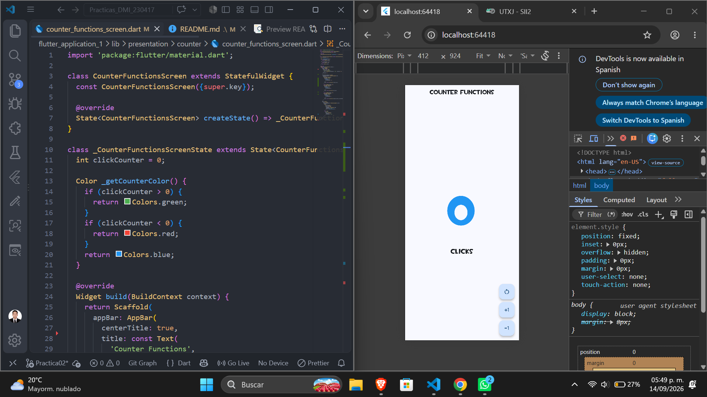
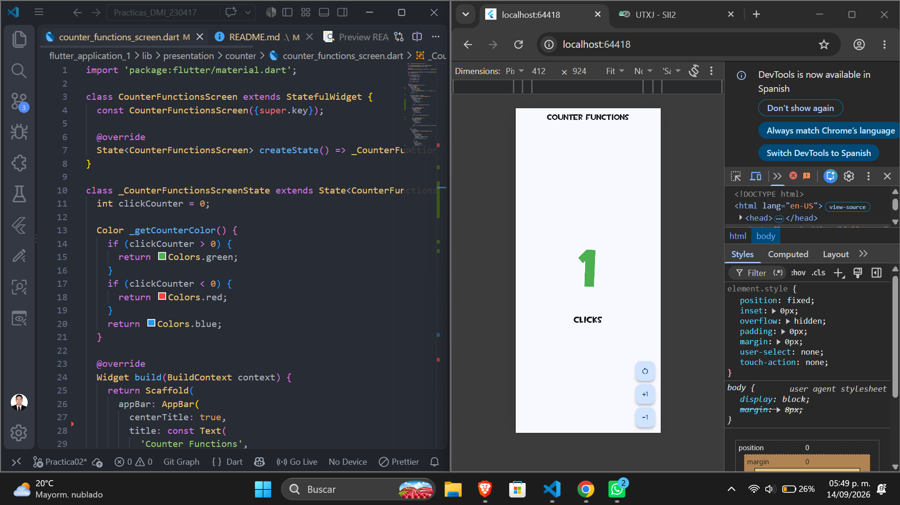
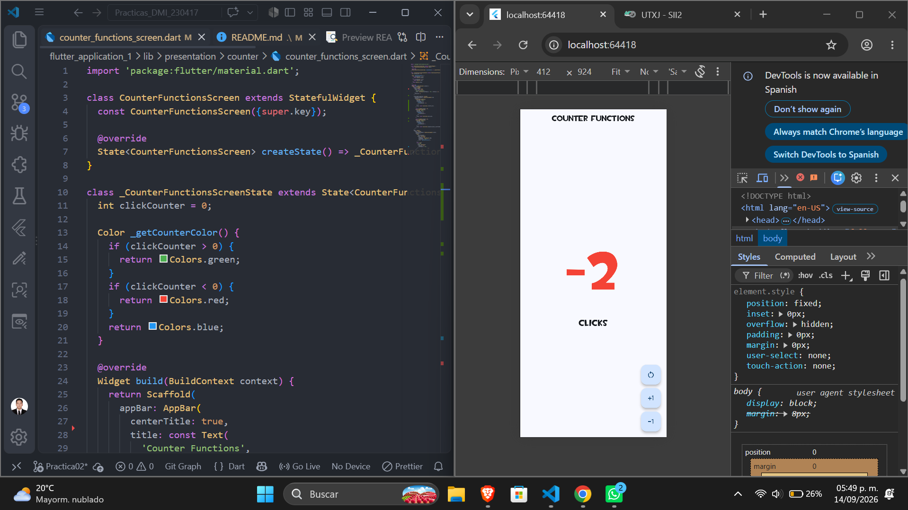

# Practica02 - Counter Functions

## Objetivo de la práctica

Mi Primer Aplicación Móvil con Flutter. La práctica consiste en agregar los botones de funcionalidad al contador: uno para aumentar de uno en uno, otro para disminuir de uno en uno y otro para reiniciar el valor. Además, el número cambia de color según su estado: **verde** cuando es positivo, **rojo** cuando es negativo y **azul** cuando está en neutro (0). También se aplica el principio de **polimorfismo** en la lógica de los botones, usando una clase abstracta `CounterAction` con distintas subclases para cada acción.


[Abrir diagrama interactivo](https://jffa25.github.io/Practicas_DMI_230417/arquitectura-flutter-application.html)


## Tecnologías utilizadas

- Flutter / Dart
- Material Design (Widgets: `Scaffold`, `FloatingActionButton`, `StatefulWidget`)

## Descripción de la solución

Se definió una clase abstracta `CounterAction` con el método `execute(int currentValue)`. A partir de ella se crearon tres subclases:

- `IncrementAction` → suma 1 al contador
- `DecrementAction` → resta 1 al contador
- `ResetAction` → reinicia el contador a 0

Los botones (`FloatingActionButton`) se generan dinámicamente a partir de una lista de objetos `CounterAction`, y al presionarlos se invoca `action.execute(clickCounter)` sin necesidad de identificar el tipo concreto de la acción.

## Resultados obtenidos

- Se agregaron los tres botones funcionales: incrementar, decrementar y reiniciar.
- El contador cambia de color dinámicamente: verde si es mayor a 0, rojo si es menor a 0, azul si es 0.
- Se eliminó la lógica condicional para diferenciar el comportamiento de cada botón, aplicando polimorfismo.
- El código quedó más escalable: agregar una nueva acción solo requiere crear una nueva subclase.


## Evidencia de funcionamiento

| Estado inicial | Contador positivo | Contador negativo |
|:---:|:---:|:---:|
|  |  |  |

## Cómo ejecutar el proyecto

```bash
flutter pub get
flutter run
```

## Conclusiones

La implementación del polimorfismo permitió desacoplar la interfaz de usuario de la lógica de negocio de cada botón. Esto facilita el mantenimiento del código y sienta las bases para aplicar otros principios de POO en prácticas futuras.

## Autor

- Jose Francisco Flores Amador