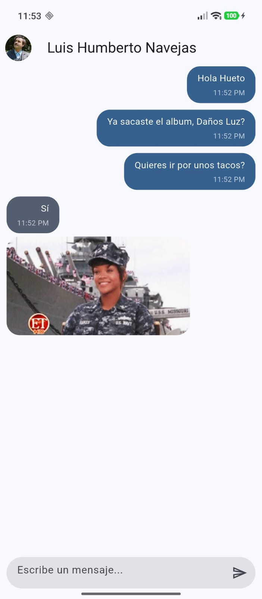
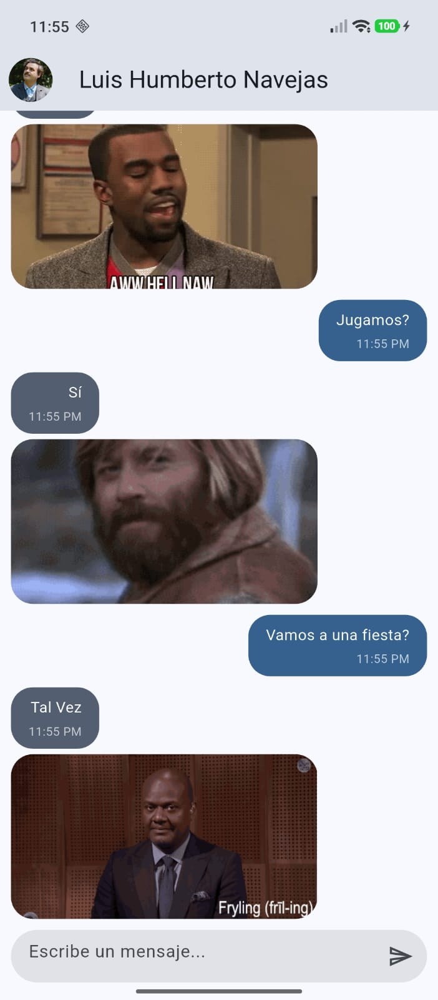
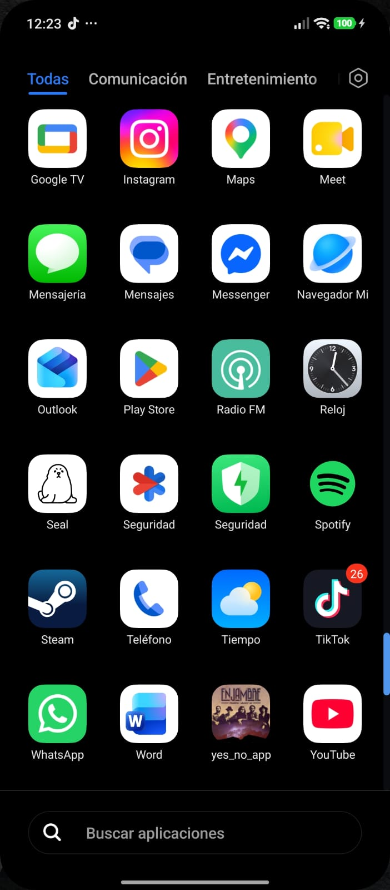

# Práctica 03 - Yes, No, Maybe

## Objetivo de la práctica

Desarrollar una aplicación de chat con Flutter que permita enviar mensajes y recibir respuestas automáticas a preguntas. Cada mensaje muestra la hora en que fue enviado, y el bot responde mediante la API de `yesno.wtf` con una distribución de **40 % Sí, 40 % No y 20 % Tal Vez**, incluyendo el GIF asociado a la respuesta.

## Funcionalidades

- Enviar mensajes de texto desde el campo de conversación.
- Mostrar la hora local de envío en cada mensaje, tanto del usuario como del bot.
- Recibir una respuesta automática cuando el mensaje del usuario termina en `?`.
- Elegir respuestas con probabilidades de 40 % Sí, 40 % No y 20 % Tal Vez.
- Mostrar el GIF devuelto por la API para cada respuesta.
- Desplazar la conversación automáticamente al mensaje más reciente.

## Tecnologías utilizadas

- Flutter y Dart
- Material Design
- `provider` para administrar el estado del chat
- `dio` para realizar solicitudes HTTP
- API [yesno.wtf](https://yesno.wtf/api)

## Descripción de la solución

La entidad `Message` guarda el texto, el remitente, la URL opcional del GIF y la hora local de envío. `ChatProvider` agrega los mensajes del usuario y solicita una respuesta cuando detecta que el texto termina en signo de interrogación.

`GetYesNoAnswer` selecciona una de cinco opciones equiprobables: dos `yes`, dos `no` y una `maybe`. Luego solicita a `yesno.wtf` la respuesta seleccionada mediante el parámetro `force`. La respuesta de la API se convierte a la entidad del chat, que muestra **Sí**, **No** o **Tal Vez** junto con su GIF.

Las burbujas del usuario y del bot presentan el texto y la hora del mensaje. La burbuja del bot muestra además la imagen cuando la respuesta incluye una URL.
## Evidencia de funcionamiento

## Resultados Obtenidos

| Si | No | Tal Vez | Icono de la App|    
|:---:|:---:|:---:|:---:|
|  |  |  ||


## Cómo ejecutar el proyecto

Desde la carpeta `yes_no_app`, ejecuta:

```bash
flutter pub get
flutter run
```

## Conclusiones

La práctica integra administración de estado, consumo de una API y visualización de contenido multimedia en una interfaz de chat. El modelo de mensajes centraliza la hora de envío y permite que tanto los mensajes propios como las respuestas automáticas compartan la misma estructura.

## Autor

- Jose Francisco Flores Amador