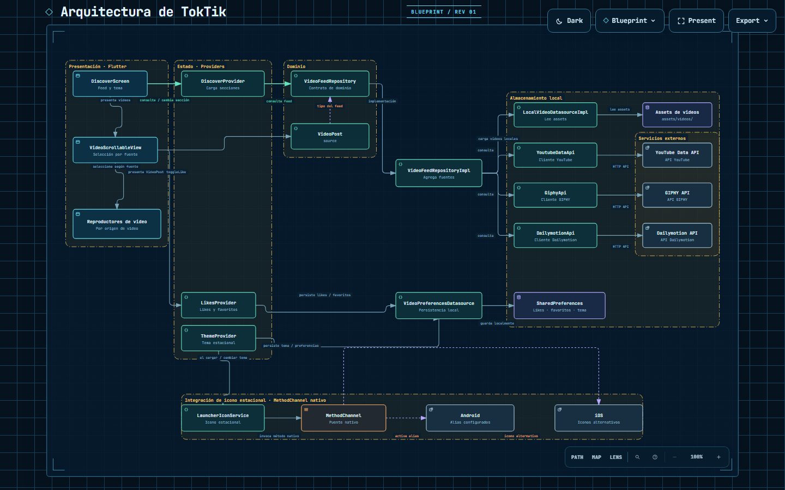
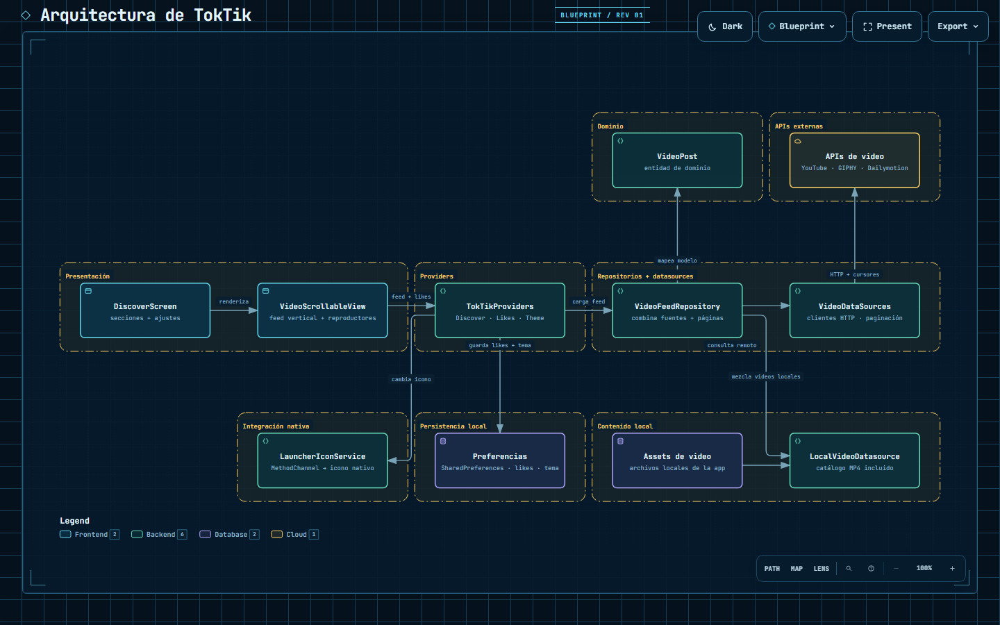

# Práctica 04 — TokTik

## Descripción

TokTik es una aplicación Flutter de videos cortos. Reúne publicaciones locales
y contenido de proveedores externos en feeds independientes, permite
interactuar con los videos y personaliza la experiencia con temas estacionales.
La app separa presentación, lógica de dominio, repositorios y fuentes de datos.


## Diagrama de arquitectura

### Arquitectura general

Flujo por capas: presentación, estado y dominio, repositorios/datasources, APIs
externas, persistencia local e integración nativa para los iconos estacionales.

[Abrir diagrama interactivo en GitHub Pages](https://jffa25.github.io/Practicas_DMI_230417/Practica04/toktik/arquitectura-toktik/architecture-toktik.preflight.html)

[](https://jffa25.github.io/Practicas_DMI_230417/Practica04/toktik/arquitectura-toktik/architecture-toktik.preflight.html)

### Arquitectura general (diagrama actualizado)

El diagrama muestra las capas de la app, las fuentes de video y la persistencia
local.

[Abrir diagrama interactivo en GitHub Pages](https://jffa25.github.io/Practicas_DMI_230417/Practica04/toktik/arquitectura-toktik/arquitectura-toktik.html)

[](https://jffa25.github.io/Practicas_DMI_230417/Practica04/toktik/arquitectura-toktik/arquitectura-toktik.html)

## Iconos

| TokTik| TokTik Hallowen | TokTik Navidad|
|:---:|:---:|:---:|
|  |  |  |


## Evidencia

Vista previa animada; haz clic para abrir el video completo:

[](https://github.com/user-attachments/assets/cbe2ba88-b0c1-4e0d-a317-9fe3de8a1053)

[Ver video completo (MP4)](https://github.com/user-attachments/assets/cbe2ba88-b0c1-4e0d-a317-9fe3de8a1053)

## Funcionalidades

### Feeds y reproducción

- **Discover:** combina videos locales con resultados de YouTube, GIPHY y
  Dailymotion. Carga más resultados al acercarse al final del feed y evita
  repetir videos al anexar páginas.
- **For You:** presenta una selección de tendencias de las fuentes disponibles.
- **Favorites:** muestra los videos marcados con «Me gusta».
- Los tres feeds se recorren verticalmente; el cambio de sección y los botones
  de navegación permiten pasar entre Discover, For You y Favorites.
- Reproduce videos incluidos en la app, videos de YouTube, GIFs/videos de GIPHY
  y videos de Dailymotion.
- Los fallos de un proveedor no impiden mostrar resultados disponibles de los
  otros proveedores ni los videos locales.

### Interacción y preferencias

- El botón de sonido activa o silencia el video y mantiene esa elección al
  cambiar de video durante la sesión.
- Tocar el corazón cambia el estado de «Me gusta»; un doble toque sobre el
  video también lo marca como favorito.
- Los estados de «Me gusta» y sus conteos se guardan localmente con
  `SharedPreferences`, por lo que sobreviven al cierre de la app mientras no se
  borren sus datos.
- Las descripciones extensas se pueden expandir con «... más» y leer con
  desplazamiento vertical.
- Hay un video local de prueba con cero likes y cero comentarios para comprobar
  el estado inicial y la persistencia del conteo.

### Temas por temporada e icono

- Incluye los temas **Normal**, **Halloween**, **Christmas** y
  **Valentine's Day**, con sus paletas, tipografías, iconografía y avisos
  auditivos.
- El modo automático selecciona el tema usando la fecha local del dispositivo:
  Halloween en octubre, Christmas en diciembre, Valentine's Day en febrero y
  Normal el resto del año.
- Para probar otra temporada, abre el botón de tema en la parte superior y
  selecciona una opción. La selección manual se guarda y permanece tras cerrar
  y volver a abrir la app, hasta elegir otro tema o regresar a **Automático por
  fecha**.
- El icono de inicio del dispositivo se actualiza para corresponder con el tema
  seleccionado y se vuelve a aplicar al iniciar la app.
- El aviso auditivo que acompaña el cambio de tema se puede activar o desactivar
  desde el mismo menú.

## Arquitectura

La interfaz consume proveedores de estado de presentación. `DiscoverProvider`
obtiene las secciones mediante el contrato `VideoFeedRepository`; su
implementación combina los resultados de `LocalVideoDatasourceImpl`,
`YoutubeDataApi`, `GiphyApi` y `DailymotionApi`. Discover maneja la paginación
de las fuentes que ofrecen continuación.

`LikesProvider` gestiona los likes, los conteos y la lista de favoritos.
`ThemeProvider` resuelve la temporada automática o manual, las preferencias de
sonido y la selección del icono. Ambos persisten preferencias mediante
`VideoPreferencesDatasource` y `SharedPreferences`.

## Tecnologías principales

- **Flutter y Dart:** interfaz multiplataforma.
- **Provider:** estado de presentación.
- **Repositorios y datasources:** separación entre dominio y fuentes de video.
- **SharedPreferences:** persistencia local de likes, temas y preferencias.
- **video_player:** reproducción de videos locales y archivos MP4 remotos.
- **youtube_player_iframe:** reproducción de YouTube.
- **webview_flutter:** integración del reproductor de Dailymotion.
- **http:** solicitudes a las API de video.

## Configuración

Los videos locales están en `assets/videos/`. Para usar YouTube y GIPHY,
crea un archivo `env.json` en la raíz de este proyecto (`toktik`) con las claves
de API correspondientes:

```json
{
  "YOUTUBE_API_KEY": "TU_CLAVE_DE_YOUTUBE",
  "YOUTUBE_SEARCH_QUERY": "musica",
  "GIPHY_API_KEY": "TU_CLAVE_DE_GIPHY",
  "GIPHY_SEARCH_QUERY": "funny"
}
```

El archivo `env.json` es opcional para iniciar la aplicación y ver los videos
locales. Si faltan claves, las fuentes que las necesitan mostrarán un aviso.
Dailymotion se consulta mediante su API pública.

No agregues claves reales al control de versiones. Las claves incluidas en una
aplicación cliente pueden extraerse; para producción, restrínjelas o utiliza un
backend.

## Ejecutar y validar

Desde la carpeta `Practica04/toktik`:

```bash
flutter pub get
flutter run --dart-define-from-file=env.json
```

Para iniciar sin `env.json`, ejecuta `flutter run`. Para validar el proyecto:

```bash
flutter analyze
flutter test
```

Para generar una compilación de depuración Android:

```bash
flutter build apk --debug
```

## Autor

- Jose Francisco Flores Amador
